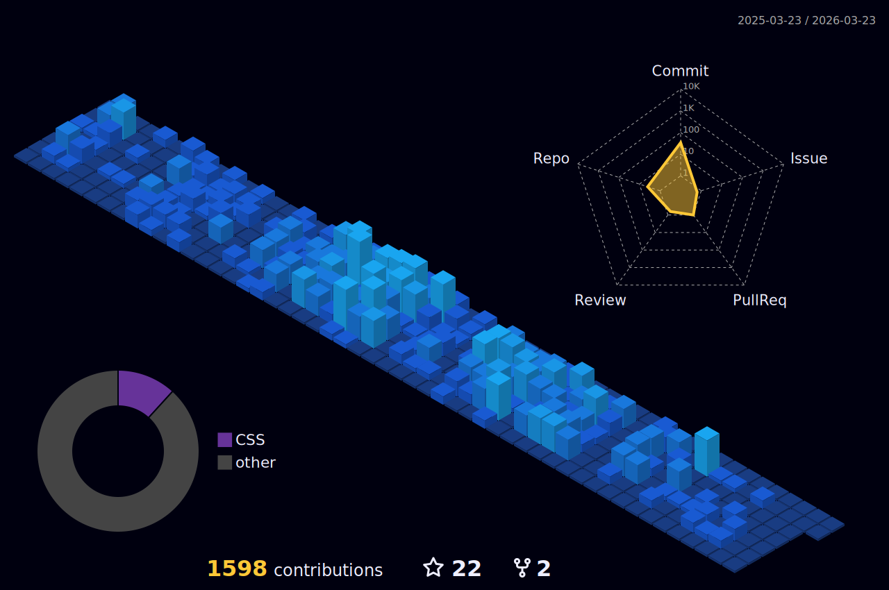
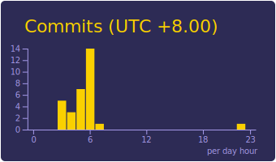
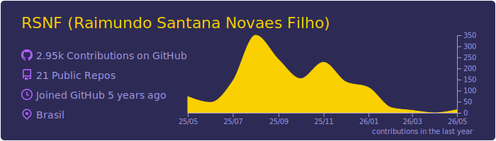

<link rel="stylesheet" href="https://cdn.jsdelivr.net/gh/devicons/devicon@v2.15.1/devicon.min.css">
                    
<h1 align="center"> :wave: Olá, pode me chamar de Rai!</h1>

<h3 align="center">Um Pouco Sobre Mim</h3>

\- :books: Bacharel em Sistemas de Informação da Universidade Estadual do Sudoeste da Bahia;

\- :computer: Focado em Backend;

\- :skull: Principais habilidades incluem PHP e Node.js;

---

---

---

<h3 align="center">Minhas Skills</h3>

 

 

---

<h3 align="center">Meus Contatos</h3>

 

